# OMS 订单系统 — 架构与业务流程（经验分享）

本文档用于系统经验分享，详细描述系统技术框架与核心业务流程，并配有流程图说明。

---

## 一、系统整体架构

### 1.1 技术栈总览

| 层级 | 技术 | 说明 |
|------|------|------|
| **前端** | Vue 3 + TypeScript | 单页应用 |
| | Vite 5 | 构建与开发服务器 |
| | Element Plus | UI 组件库 |
| | Vue Router 4 | 路由 |
| | Pinia | 状态管理 |
| | Axios | HTTP 请求，BaseURL `/api` |
| **后端** | Spring Boot 3.2.4 | Java 17 |
| | Spring Data JPA | 持久化 |
| | Spring Security + JWT | 认证与鉴权 |
| | MySQL 8 | 数据库 |
| **文档/扩展** | Apache POI、iText、PDFBox | Excel/PDF、电子签章 |
| | 快递100 | 物流查询（可选） |

### 1.2 系统架构图

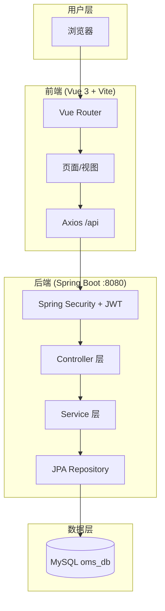

### 1.3 后端分层结构

```
oms-backend/
├── com.oms
│   ├── OmsApplication.java          # 启动类 + 初始化管理员
│   ├── config/                      # 配置（Web、CORS、Jackson、快递100）
│   ├── controller/                  # REST 接口
│   ├── entity/                      # JPA 实体
│   ├── repository/                  # JPA Repository
│   ├── service/                     # 业务逻辑
│   ├── security/                    # JWT、Security 配置、UserDetails
│   ├── util/                        # 工具类（金额、Excel 导出等）
│   └── exception/                   # 全局异常处理
```

### 1.4 前端模块与路由

| 菜单/模块 | 路径 | 说明 |
|-----------|------|------|
| 登录 | `/login` | 无需 Token |
| 首页 | `/dashboard` | 仪表盘 |
| 我的商品 | `/product` | 产品主数据（可免登访问） |
| 商机管理 | `/opportunity` | 商机录入与跟进 |
| 销售管理 | `/sales` | 销售订单全流程（可免登访问） |
| 采购管理 | `/purchase` | 采购订单 |
| 客户结算 | `/settlement/invoice`、`/settlement/list` | 对账单、结算单 |
| 合作管理 | `/cooperation/contract`、`contract-template`、`partner-info` | 合同、合同模板、用户信息维护 |
| 用户管理 | `/user/list` | 用户列表（管理员） |

---

## 二、认证与权限流程

### 2.1 登录认证流程

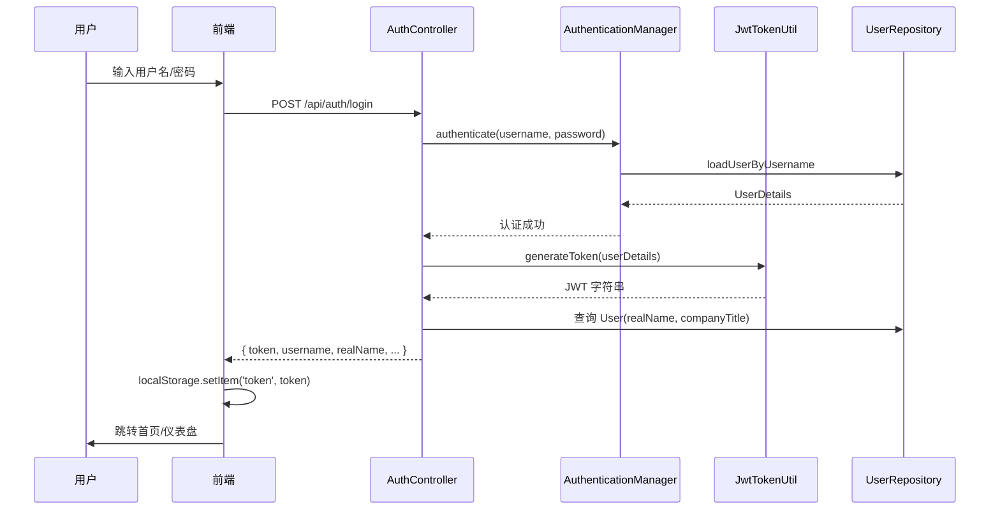

### 2.2 请求鉴权流程

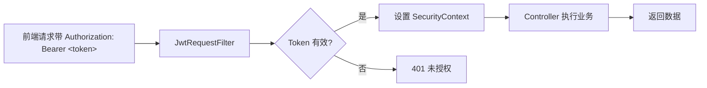

### 2.3 权限规则摘要

- **放行接口**：`/api/auth/login`、`/api/auth/register`、`/uploads/**`、`/api/files/**`、`/api/upload`、`/api/debug/**`、`/api/barcode/**`
- **其余接口**：需携带有效 JWT，否则 401
- **业务数据权限**：
  - 销售订单/合同：管理员看全部；普通用户仅看「自己创建」或「被指派给自己」的订单
  - 采购订单：管理员看全部；普通用户仅看自己创建的采购单

---

## 三、核心业务流程

### 3.1 从商机到结算的整体业务链路

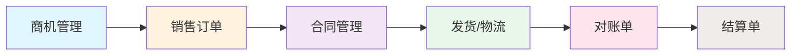

### 3.2 销售订单状态流转

销售订单状态包括：**待指派 → 待确认订单 → 待合同盖章 → 已发货 → 已到货 → 已开票 → 已支付 → 平台已支付**，以及 **已取消**、**已退回**、**已对账** 等。

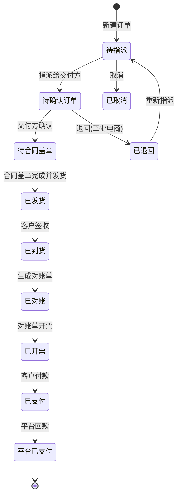

### 3.3 销售订单详细业务流程（含角色）

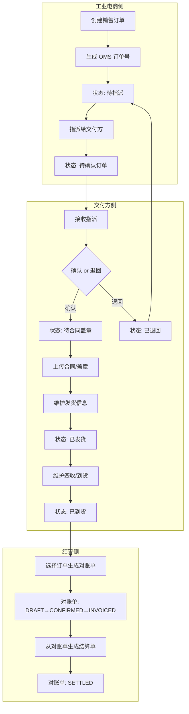

### 3.4 对账单与结算单流程

对账单状态：**DRAFT → PENDING(待确认) → CONFIRMED → APPLIED(待开票) → INVOICED(已开票) → SETTLED(已结算)**  
结算单状态：**DRAFT → PENDING → SETTLED**

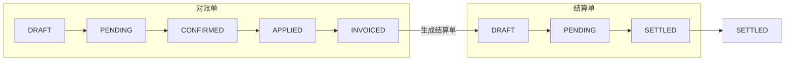

- **对账单**：由多笔销售订单汇总生成（InvoiceService），订单状态会更新为「已对账」。
- **结算单**：由状态为「已开票」的对账单生成（SettlementService），生成后对账单状态更新为 SETTLED。

### 3.5 合同管理流程

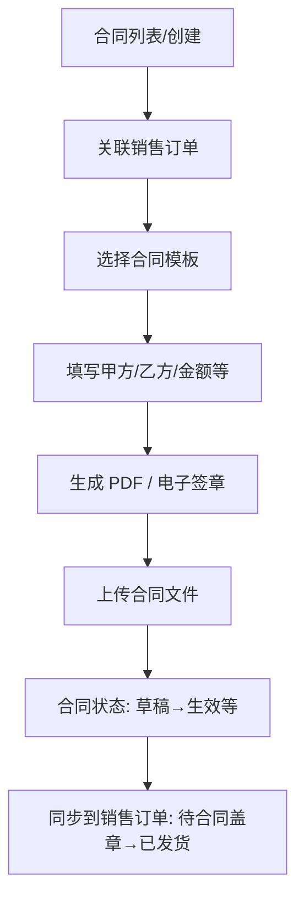

合同与销售订单通过 `sales_order_id` 或业务关联；合同盖章完成后，销售订单可进入「已发货」等后续状态。

### 3.6 采购订单流程

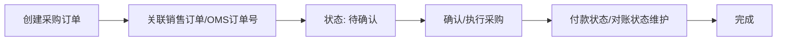

- 采购订单与销售订单通过 `omsOrderNo` 等字段关联，用于「以销定采」场景。
- 权限：非管理员仅能查看/操作自己创建的采购订单。

### 3.7 物流与发货

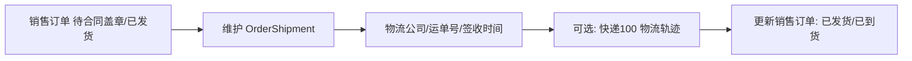

- **OrderShipment**：按销售订单维度存储发货信息（物流公司、单号、签收时间、送货单/签收单/箱唛 URL 等）。
- 销售订单上的物流、签收等字段可由 OrderShipment 回写更新。

---

## 四、关键实体关系（概念）

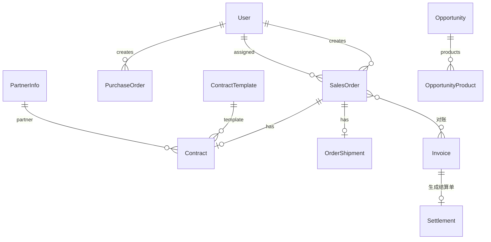

---

## 五、经验分享可强调的点

1. **前后端分离**：前端 Vite 开发态代理 `/api` 到后端 8080，生产可 Nginx 反向代理。
2. **无状态认证**：JWT + Spring Security 过滤链，便于水平扩展。
3. **数据权限**：在 Service 层按当前用户角色与「创建人/指派人」过滤，保证订单与合同数据隔离。
4. **订单号规则**：工业电商销售订单号 = (D?) + 日期 + 姓名首字母 + 流水号，便于追溯与排重。
5. **状态机清晰**：销售订单、对账单、结算单、合同均有明确状态流转，便于对业务方讲解和后续扩展（如工作流引擎）。
6. **文档与扩展**：合同 PDF、电子签章、Excel 导出、条码等集中在独立 Service，便于维护和替换实现。

---

## 六、如何查看流程图

- **本目录下的 `流程图-可视化.html`**：用浏览器直接打开该文件，可看到所有流程图的渲染效果，便于截图或投屏分享。
- **VS Code**：安装 “Markdown Preview Mermaid Support” 或 “Mermaid” 插件后，打开本 MD 文件预览即可看到 Mermaid 图。
- **在线**：将 Mermaid 代码复制到 [Mermaid Live Editor](https://mermaid.live/) 可编辑并导出为 PNG/SVG。
- **导出为图片**：在 Mermaid Live 或 VS Code 导出功能中导出为 PNG/SVG，插入到 PPT 或 Word 中用于分享。

---

*文档基于当前代码整理，若后续状态或接口有调整，请以实际代码为准。*
